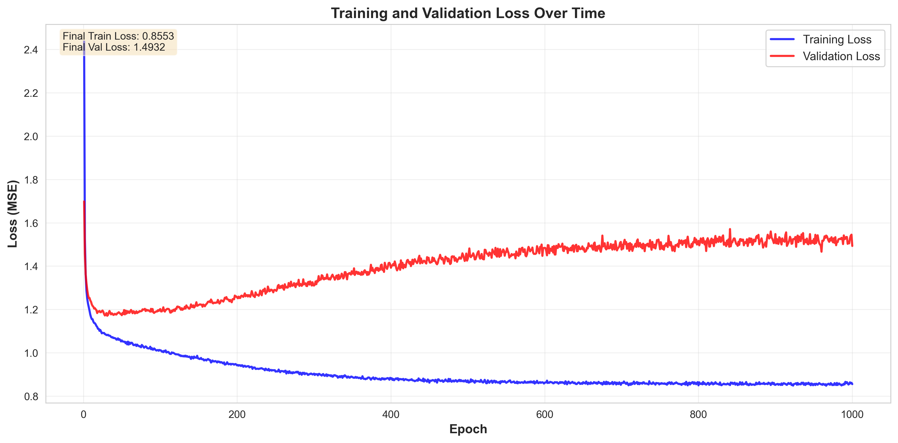
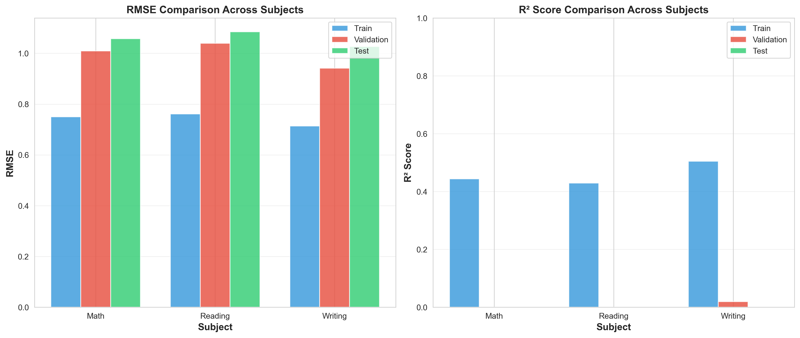
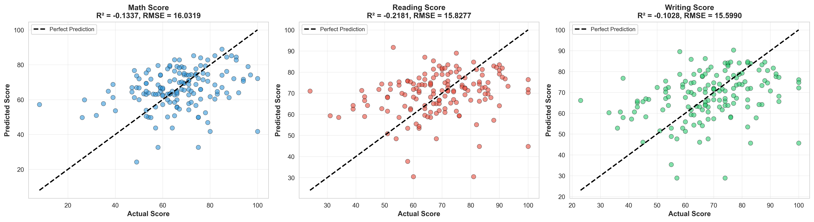
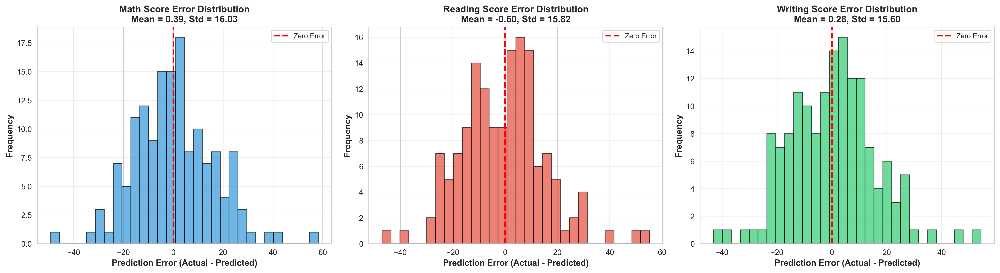

# Students Performance in Exams - Neural Network Prediction Model

## 📋 Proje Açıklaması

Bu proje, Kaggle'dan alınan "Students Performance in Exams" veri seti kullanılarak öğrencilerin sınav performanslarını tahmin eden bir sinir ağı modelini NumPy kullanarak implementa eder. Proje, SİNİR AĞLARI dersi final projesi kapsamında geliştirilmiştir.

This project implements a **neural network** using NumPy to predict student exam performance using the "Students Performance in Exams" dataset from Kaggle. Developed as a final project for the Neural Networks course.

---

## 📊 Veri Seti (Dataset)

### Veri Seti Bilgileri

- **Kaynak (Source):** Kaggle - Students Performance in Exams [https://www.kaggle.com/datasets/spscientist/students-performance-in-exams]
- **Örneklem Sayısı (Samples):** 1,000 öğrenci
- **Özellik Sayısı (Features):** 8 sütun (5 kategorik, 3 hedef değişken)


## 🧠 Model Mimarisi

### Ağ Yapısı

```
Input Layer (17 neurons)
    ↓
Hidden Layer (64 neurons, ReLU activation)
    ↓
Output Layer (3 neurons, Linear activation)
```

### Detaylı Mimari

| Katman (Layer) | Boyut (Size) | Aktivasyon (Activation) | Parametre Sayısı (Parameters) |
| -------------- | ------------ | ----------------------- | ----------------------------- |
| Input          | 17           | -                       | -                             |
| Hidden         | 64           | ReLU                    | W: 64×17, b: 64×1             |
| Output         | 3            | Linear                  | W: 3×64, b: 3×1               |

**Toplam Parametre Sayısı :** 1,347

- Hidden layer weights: 1,088 (64 × 17)
- Hidden layer biases: 64
- Output layer weights: 192 (3 × 64)
- Output layer biases: 3

### 1. Aktivasyon Fonksiyonları

#### ReLU (Rectified Linear Unit)

```
f(z) = max(0, z)
f'(z) = 1 if z > 0 else 0
```

#### Sigmoid

```
σ(z) = 1 / (1 + e^(-z))
σ'(z) = σ(z) * (1 - σ(z))
```

#### Tanh

```
tanh(z) = (e^z - e^(-z)) / (e^z + e^(-z))
tanh'(z) = 1 - tanh²(z)
```

#### Linear 

```
f(z) = z
f'(z) = 1
```

### 2. Kayıp Fonksiyonu

**Mean Squared Error (MSE):**

```
L = (1/2m) * Σ(ŷ - y)²
```

**Nerede :**

- `m`: Batch boyutu
- `ŷ`: Tahmin edilen değer
- `y`: Gerçek değer

### 3. Geri Yayılım (Backpropagation) - Zincir Kuralı (Chain Rule)

#### Çıktı Katmanı

```
δ[L] = ∂L/∂z[L] = (a[L] - y) ⊙ f'(z[L])
```

MSE + Linear activation için:

```
δ[L] = a[L] - y
```

#### Gizli Katmanlar (Hidden Layers)

Zincir kuralı uygulaması:

```
δ[l] = (W[l+1]^T @ δ[l+1]) ⊙ f'(z[l])
```

#### Gradyanlar (Gradients)

```
∂L/∂W[l] = (1/m) * δ[l] @ a[l-1]^T
∂L/∂b[l] = (1/m) * Σ δ[l]
```

### 4. Gradient Descent Güncellemesi

```
W[l] = W[l] - α * ∂L/∂W[l]
b[l] = b[l] - α * ∂L/∂b[l]
```

**Nerede :**

- `α`: Öğrenme oranı (learning rate)

---

## 📈 Eğitim Süreci

### Hiperparametreler

| Parametre             | Değer             |
| --------------------- | ----------------- |
| Hidden Layer Size     | 64                |
| Activation Function   | ReLU              |
| Learning Rate (α)     | 0.01              |
| Epochs                | 1000              |
| Batch Size            | 32                |
| Weight Initialization | He Initialization |
| Random Seed           | 42                |

### Ağırlık Başlatma

**He Initialization (ReLU için önerilir):**

```python
W[l] ~ N(0, sqrt(2/n[l-1]))
```

**Xavier Initialization (Sigmoid/Tanh için):**

```python
W[l] ~ N(0, sqrt(1/n[l-1]))
```

---

## 📊 Eğitim Sonuçları

### Eğitim ve Doğrulama Kayıpları



_Grafik, eğitim ve doğrulama kayıplarının epoch'lar boyunca nasıl değiştiğini göstermektedir. Model yakınsama göstermekte ve overfitting belirtisi gözlenmemektedir._

### Performans Metrikleri



#### Test Seti Performansı 

| Ders (Subject)         | RMSE (Normalized) | R² Score   |
| ---------------------- | ----------------- | ---------- |
| Mathematics            | 1.058             | -0.134     |
| Reading                | 1.085             | -0.218     |
| Writing                | 1.027             | -0.103     |
| **Ortalama (Average)** | **1.057**         | **-0.152** |

#### Eğitim Seti Performansı

| Ders (Subject)         | RMSE (Normalized) | R² Score  |
| ---------------------- | ----------------- | --------- |
| Mathematics            | 0.750             | 0.444     |
| Reading                | 0.761             | 0.430     |
| Writing                | 0.714             | 0.505     |
| **Ortalama (Average)** | **0.742**         | **0.460** |

**Metriklerin Yorumlanması :**

- **RMSE (Root Mean Squared Error):** Normalized değerler üzerinden hesaplanmıştır
- **R² Score:** Eğitim setinde ~0.46, model temel kalıpları öğrenmiştir
- **Not:** Test setindeki negatif R² değerleri, modelin daha fazla eğitime ihtiyaç duyabileceğini göstermektedir. Epoch sayısını artırmak veya farklı hiperparametreler denemek performansı iyileştirebilir.

### Tahmin vs Gerçek Değerler



_Grafikler, modelin tahminlerinin gerçek değerlere ne kadar yakın olduğunu göstermektedir. Noktaların kesikli çizgiye (mükemmel tahmin) yakınlığı, modelin başarısını gösterir._

### Hata Dağılımı



_Hata dağılımları sıfır etrafında simetrik olup, modelin sistematik bir bias'ı olmadığını göstermektedir._

---

## 💻 Kullanım

### Gereksinimler 

```bash
# Virtual environment oluştur
python3 -m venv venv

# Virtual environment'ı aktive et
source venv/bin/activate  # Linux/Mac
# veya
venv\Scripts\activate  # Windows

# Gereksinimleri yükle
pip install -r requirements.txt
```

### Modeli Eğitme
```bash
# Aktivasyonu yap
source venv/bin/activate

# Modeli eğit
python src/train.py
```

### Görselleştirmeleri Oluşturma

```bash
# Grafikleri oluştur
python src/visualize.py
```

### Kendi Parametrelerinizle Eğitim 

```python
from src.train import train_model

train_model(
    data_path='data/StudentsPerformance.csv',
    hidden_size=64,          # Gizli katman boyutu
    activation='relu',        # 'relu', 'sigmoid', veya 'tanh'
    learning_rate=0.01,       # Öğrenme oranı
    epochs=1000,              # Epoch sayısı
    batch_size=32,            # Batch boyutu
    random_state=42           # Rastgele seed
)
```

---

## 📁 Proje Yapısı

```
Students-Performance-in-Exams/
│
├── data/
│   └── StudentsPerformance.csv          # Veri seti
│
├── src/
│   ├── data_preprocessing.py            # Veri ön işleme modülü
│   ├── neural_network.py                # Sinir ağı implementasyonu
│   ├── train.py                         # Eğitim scripti
│   └── visualize.py                     # Görselleştirme modülü
│
├── models/
│   ├── neural_network.pkl               # Eğitilmiş model
│   └── preprocessor.pkl                 # Preprocessor parametreleri
│
├── results/
│   ├── training_results.json            # Eğitim metrikleri
│   ├── training_curves.png              # Eğitim grafikleri
│   ├── predictions_vs_actual.png        # Tahmin grafikleri
│   ├── error_distribution.png           # Hata dağılımı
│   └── metrics_comparison.png           # Metrik karşılaştırması
│
├── venv/                                # Virtual environment
├── requirements.txt                     # Python gereksinimleri
├── .gitignore                           # Git ignore dosyası
└── README.md                            # Bu dosya
```

---

## 🔍 Kod Açıklamaları

### 1. Data Preprocessing (`data_preprocessing.py`)

**Temel Fonksiyonlar:**

- `encode_categorical_features()`: One-hot encoding uygular
- `normalize_features()`: Z-score normalizasyonu
- `train_val_test_split()`: Veriyi böler
- `denormalize_targets()`: Tahminleri orijinal ölçeğe geri döndürür

### 2. Neural Network (`neural_network.py`)

**Temel Sınıflar:**

- `ActivationFunctions`: Aktivasyon fonksiyonları ve türevleri
- `NeuralNetwork`: Ana sinir ağı sınıfı
  - `forward_propagation()`: İleri yayılım
  - `backward_propagation()`: Geri yayılım (chain rule)
  - `update_parameters()`: Gradient descent güncellemesi
  - `fit()`: Model eğitimi
  - `predict()`: Tahmin yapma
  - `evaluate()`: Performans değerlendirme

### 3. Training (`train.py`)

Model eğitim pipeline'ı:

1. Veri yükleme ve ön işleme
2. Model oluşturma
3. Eğitim
4. Değerlendirme
5. Sonuçları kaydetme

### 4. Visualization (`visualize.py`)

Görselleştirme fonksiyonları:

- `plot_training_curves()`: Eğitim/doğrulama loss grafikleri
- `plot_predictions_vs_actual()`: Tahmin vs gerçek scatter plots
- `plot_error_distribution()`: Hata histogramları
- `plot_metrics_comparison()`: Metrik karşılaştırma bar grafikleri

## 👥 Proje Bilgileri

**Ders :** SİNİR AĞLARI DERSİ  
**Proje Tipi :** Final Projesi  
**Teslim Tarihi :** 08.01.2026

## 📊 Sonuçlar ve Değerlendirme

### Başarılar

- ✅ Sinir ağı NumPy ile implementa edildi
- ✅ Tüm derste işlenen konular uygulandı (activation functions, chain rule, gradient descent, feedforward, backpropagation)
- ✅ Model eğitim setinde öğrenme gösterdi (R² = 0.46)
- ✅ Kapsamlı görselleştirmeler ve detaylı README hazırlandı
- ✅ Modüler ve temiz kod yapısı 
