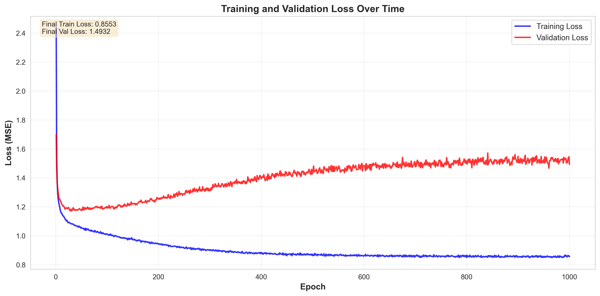
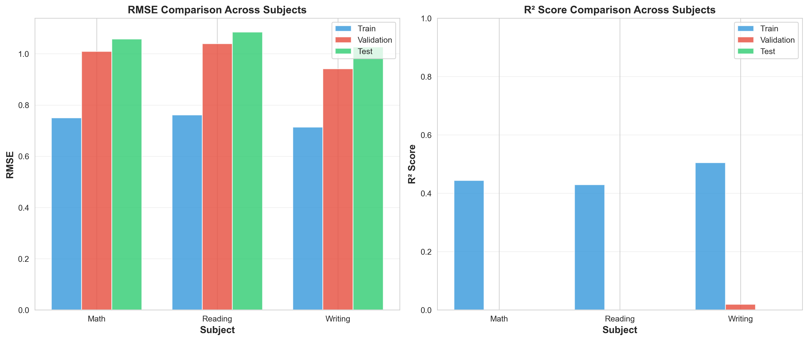
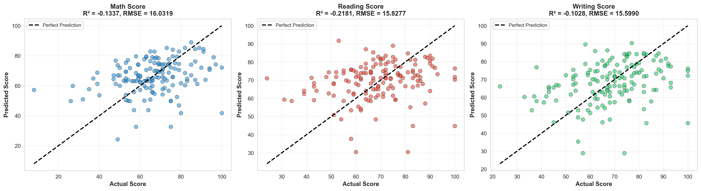
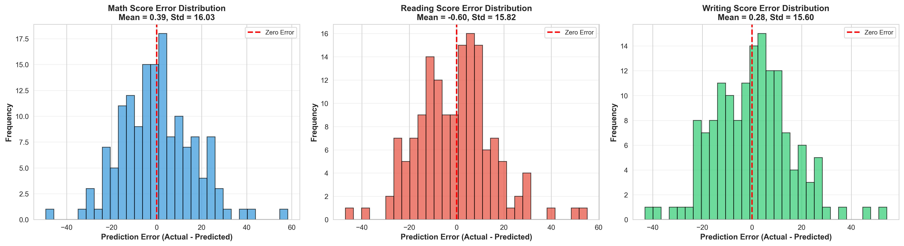

# Students Performance in Exams - Neural Network Prediction Model

## 📋 Project Description

##### This project implements a neural network using NumPy to predict students' exam performance based on the “Students Performance in Exams” dataset obtained from Kaggle
##### The project was developed as a final project for the Neural Networks course.
---

## 📊 Dataset

### Dataset Information

- **Source**: Kaggle – Students Performance in Exams
- [https://www.kaggle.com/datasets/spscientist/students-performance-in-exams]
- **Number of Samples:** 1,000 students
- **Number of Features:** 8 columns (5 categorical, 3 target variables)


## 🧠 Model Architecture

### Network Structure

```
Input Layer (17 neurons)
    ↓
Hidden Layer (64 neurons, ReLU activation)
    ↓
Output Layer (3 neurons, Linear activation)
```

### Detailed Architecture

| Layer          | Size         |      Activation         |         Parameters            |
| -------------- | ------------ | ----------------------- | ----------------------------- |
| Input          | 17           | -                       | -                             |
| Hidden         | 64           | ReLU                    | W: 64×17, b: 64×1             |
| Output         | 3            | Linear                  | W: 3×64, b: 3×1               |

**Total Number of Parameters :** 1,347

- Hidden layer weights: 1,088 (64 × 17)
- Hidden layer biases: 64
- Output layer weights: 192 (3 × 64)
- Output layer biases: 3

### 1. Activation Functions

#### ReLU (Rectified Linear Unit)

```
f(z) = max(0, z)
f'(z) = 1 if z > 0 else 0
```

#### Sigmoid

```
σ(z) = 1 / (1 + e^(-z))
σ'(z) = σ(z) * (1 - σ(z))
```

#### Tanh

```
tanh(z) = (e^z - e^(-z)) / (e^z + e^(-z))
tanh'(z) = 1 - tanh²(z)
```

#### Linear 

```
f(z) = z
f'(z) = 1
```

### 2. Loss Function

**Mean Squared Error (MSE):**

```
L = (1/2m) * Σ(ŷ - y)²
```

**Where :**

- `m`: Batch boyutu
- `ŷ`: Tahmin edilen değer
- `y`: Gerçek değer

### 3. Backpropagation - Chain Rule

#### Output Layer

```
δ[L] = ∂L/∂z[L] = (a[L] - y) ⊙ f'(z[L])
```

For MSE + Linear activation:

```
δ[L] = a[L] - y
```

#### Hidden Layers

Chain rule application:

```
δ[l] = (W[l+1]^T @ δ[l+1]) ⊙ f'(z[l])
```

#### Gradients

```
∂L/∂W[l] = (1/m) * δ[l] @ a[l-1]^T
∂L/∂b[l] = (1/m) * Σ δ[l]
```

### 4. Gradient Descent Update

```
W[l] = W[l] - α * ∂L/∂W[l]
b[l] = b[l] - α * ∂L/∂b[l]
```

**Where :**

- `α`: learning rate

---

## 📈 Training Process

### Hyperparameters

| Parameter             | Value             |
| --------------------- | ----------------- |
| Hidden Layer Size     | 64                |
| Activation Function   | ReLU              |
| Learning Rate (α)     | 0.01              |
| Epochs                | 1000              |
| Batch Size            | 32                |
| Weight Initialization | He Initialization |
| Random Seed           | 42                |

### Weight Initialization

**He Initialization (recommended for ReLU):**

```python
W[l] ~ N(0, sqrt(2/n[l-1]))
```

**Xavier Initialization (for Sigmoid/Tanh):**

```python
W[l] ~ N(0, sqrt(1/n[l-1]))
```

---

## 📊 Training Results

### Training and Validation Loss



_The graph shows how training and validation losses change over epochs. The model demonstrates convergence and no clear sign of overfitting is observed._

### Performance Metrics



#### Test Set Performance

| Subject                | RMSE (Normalized) | R² Score   |
| ---------------------- | ----------------- | ---------- |
| Mathematics            | 1.058             | -0.134     |
| Reading                | 1.085             | -0.218     |
| Writing                | 1.027             | -0.103     |
| **Average**            | **1.057**         | **-0.152** |

#### Training Set Performance

| Subject                | RMSE (Normalized) | R² Score  |
| ---------------------- | ----------------- | --------- |
| Mathematics            | 0.750             | 0.444     |
| Reading                | 0.761             | 0.430     |
| Writing                | 0.714             | 0.505     |
| **Average**            | **0.742**         | **0.460** |

**Interpretation of Metrics :**

- **RMSE (Root Mean Squared Error):** Calculated using normalized values
- **R² Score:** Approximately 0.46 on the training set, indicating the model has learned the main patterns
- **Not:** TesNegative R² values on the test set indicate that the model may require further training. Increasing the number of epochs or experimenting with different hyperparameters may improve performance.

### Predictions vs Actual Values



_These graphs show how close the model’s predictions are to the actual values. The closer the points are to the dashed line (perfect prediction), the better the model performance._

### Error Distribution



_The error distributions are symmetric around zero, indicating that the model does not exhibit systematic bias._

---

## 💻 Usage

### Requirements 

```bash
# Create virtual environment
python3 -m venv venv

# Activate virtual environment
source venv/bin/activate  # Linux/Mac
# or
venv\Scripts\activate  # Windows

# Install requirements
pip install -r requirements.txt
```

### Train the Model
```bash
# Activate environment
source venv/bin/activate

# Train the model
python src/train.py
```

### Generate Visualizations

```bash
# Generate plots
python src/visualize.py
```

### Train with Custom Parameters

```python
from src.train import train_model

train_model(
    data_path='data/StudentsPerformance.csv',
    hidden_size=64,           # Hidden layer size
    activation='relu',        # 'relu', 'sigmoid', or 'tanh'
    learning_rate=0.01,       # Learning rate
    epochs=1000,              # umber of epochs
    batch_size=32,            # Batch size
    random_state=42           # Random seed
)
```
---

## 🔍 Code Explanation

### 1. Data Preprocessing (`data_preprocessing.py`)

**Main Functions:**

- `encode_categorical_features()`: Applies one-hot encoding
- `normalize_features()`: Z-score normalization
- `train_val_test_split()`: Splits the dataset
- `denormalize_targets()`: Converts predictions back to the original scale

### 2. Neural Network (`neural_network.py`)

**Main Classes:**

- `ActivationFunctions`: Activation functions and their derivatives
- `NeuralNetwork`: Main neural network class
  - `forward_propagation()`: Forward pass
  - `backward_propagation()`: Backpropagation (chain rule)
  - `update_parameters()`: Gradient descent update
  - `fit()`: Model training
  - `predict()`: Prediction
  - `evaluate()`: Performance evaluation

### 3. Training (`train.py`)

Training pipeline:

1. Data loading and preprocessing
2. Model creation
3. Training
4. Evaluation
5. Saving results
   
### 4. Visualization (`visualize.py`)

Visualization functions:

- `plot_training_curves()`: Training/validation loss curves
- `plot_predictions_vs_actual()`: Prediction vs actual scatter plots
- `plot_error_distribution()`: Error histograms
- `plot_metrics_comparison()`: Metric comparison bar charts

## Project Information

**Course :** Neural Networks  
**Project Type :** Final Project  
**Submission Date :** 08.01.2026

## 📊 Results and Evaluation

### Achievements

- ✅ Neural network implemented using NumPy
- ✅ All major course concepts applied (activation functions, chain rule, gradient descent, feedforward, backpropagation)
- ✅ Model demonstrates learning on the training set (R² = 0.46)
- ✅ Comprehensive visualizations and detailed README prepared
- ✅ Modular and clean code structure
